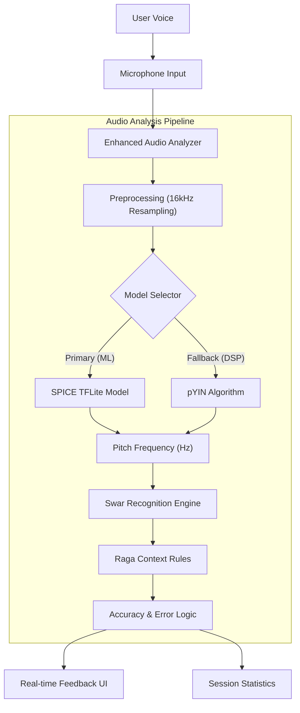
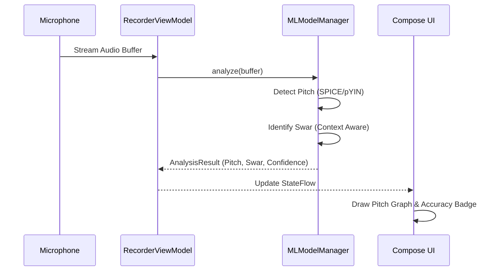

# Riwaz - Digital Riyaaz Companion 🎵

> **(c) Soumya Chakraborty**

**Riwaz** is an advanced Android application designed to assist students and practitioners of **Indian Classical Music (Hindustani)** in their daily practice (Riyaaz). By leveraging modern **Machine Learning (ML)** and **Digital Signal Processing (DSP)**, Riwaz provides real-time feedback on pitch accuracy (Sur), stability, and Raga adherence.

---

## 🚀 Key Features

- **Real-time Pitch Visualization**: See your pitch trace graphed instantly against the standard 12 swars.
- **Raga Support**: Practice with built-in Raga guides (Yaman, Bhairav, Bilawal, etc.) that highlight Vadi/Samvadi notes.
- **AI-Powered Feedback**:
  - **Pitch Detection**: Uses Google's **SPICE** model for robust tracking.
  - **Error Analysis**: Detects intonation issues (Besura) and voice instability.
  - **Swar Classification**: Identifies which swar you are singing in context of the chosen scale.
- **Tanpura & Tabla Accompaniment**: Built-in drone and rhythm support.
- **Session Analysis**: detailed breakdown of your practice session with accuracy scores and improvement tips.

---

## 🛠️ Technical Architecture

Riwaz is built using modern Android development practices:

- **Language**: Kotlin
- **UI Framework**: Jetpack Compose (Material 3)
- **Architecture Pattern**: MVVM (Model-View-ViewModel) + Clean Architecture principles
- **Asynchronous Processing**: Kotlin Coroutines & Flow
- **Machine Learning**: TensorFlow Lite (SPICE Model)
- **Audio Processing**: Custom DSP pipeline (FFT, pYIN fallback)

### System Overview



### Data Flow



---

## 📦 ML & Audio Engine

Riwaz uses a hybrid approach for maximum reliability:

1.  **Primary: neural Pitch Detection (SPICE)**
    - Uses a pre-trained **TensorFlow Lite model** (Self-supervised Pitch Estimation) for high-accuracy pitch tracking even in noisy environments.
    - Model size: ~8.7 MB.

2.  **Fallback: DSP Algorithms (pYIN)**
    - Probabilistic YIN algorithm used when ML confidence is low or model fails to load.
    - FFT-based analysis for spectral features.

3.  **Swar & Raga Engine**
    - Maps frequency to Swars based on the user's selected **Root Note (Sa)**.
    - Validates notes against Raga rules (Ascending/Descending patterns, Forbidden notes).

---

## 📥 Installation

### Prerequisites
- Android Studio Koala or newer
- JDK 17
- Android Device/Emulator (API 26+)

### Setup Steps
1.  **Clone the repository**:
    ```bash
    git clone https://github.com/Soumya-Chakraborty/Riwaz.git
    cd Riwaz
    ```

2.  **Open in Android Studio**:
    - Select "Open an existing project" and choose the `Riwaz` folder.
    - Allow Gradle to sync and download dependencies.

3.  **Verify ML Models**:
    - Ensure `app/src/main/assets/spice_model.tflite` exists.
    - If missing, run the download script:
      ```bash
      python3 ml_training/utils/download_pretrained_models.py
      ```

4.  **Build & Run**:
    - connect your Android device (ensure Developer Mode is on).
    - Click **Run** (▶️) in Android Studio.

---

## 🤝 Contributing

We welcome contributions to make Riyaaz better for everyone!

### How to Contribute
1.  **Fork** the repository.
2.  Create a **Feature Branch** (`git checkout -b feature/AmazingFeature`).
3.  **Commit** your changes (`git commit -m 'Add some AmazingFeature'`).
4.  **Push** to the branch (`git push origin feature/AmazingFeature`).
5.  Open a **Pull Request**.

### Guidelines
- Follow Kotlin coding conventions.
- Use meaningful variable and function names.
- If modifying the ML pipeline, please include verification results in the PR description.

---

## 📄 License & Copyright

**Copyright (c) Soumya Chakraborty**. All Rights Reserved.

This project is proprietary software. Unauthorized copying, distribution, or modification of this file/project, via any medium, is strictly prohibited unless explicitly authorized by the copyright holder.
